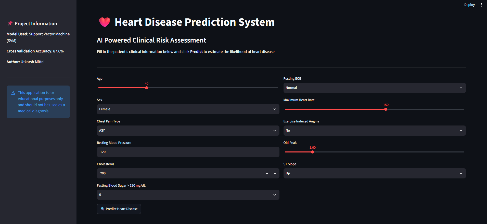
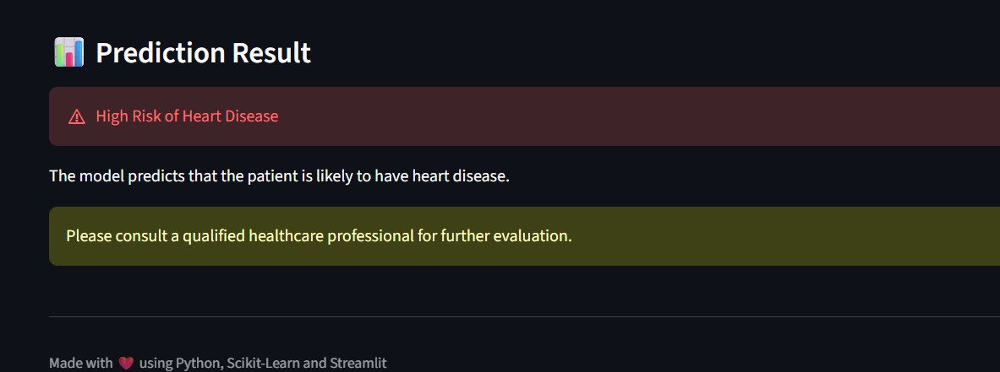
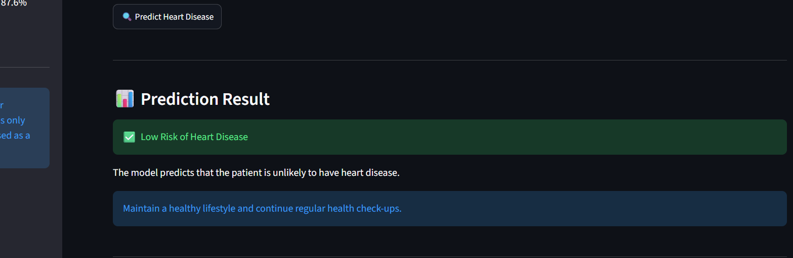

# ❤️ Heart Disease Prediction System

An end-to-end Machine Learning project that predicts the likelihood of heart disease based on a patient's clinical information. The project includes data preprocessing, exploratory data analysis (EDA), model comparison, cross-validation, and deployment using Streamlit.

---

## 📌 Project Overview

Heart disease is one of the leading causes of death worldwide. Early prediction can assist healthcare professionals in identifying high-risk patients and taking preventive measures.

This project uses supervised machine learning algorithms to predict whether a patient is likely to have heart disease based on various medical attributes.

---

## ✨ Features

- 📊 Exploratory Data Analysis (EDA)
- 🧹 Data Cleaning & Missing Value Handling
- 🔄 Feature Encoding
- 📏 Feature Scaling
- 🤖 Training Multiple Machine Learning Models
- 📈 Cross Validation
- 🌐 Streamlit Web Application
- ❤️ User-friendly Prediction Interface

---

## 🛠 Tech Stack

- Python
- Pandas
- NumPy
- Matplotlib
- Seaborn
- Scikit-learn
- Streamlit
- Joblib

---

## 📂 Dataset

The dataset contains clinical information such as:

- Age
- Sex
- Chest Pain Type
- Resting Blood Pressure
- Cholesterol
- Fasting Blood Sugar
- Resting ECG
- Maximum Heart Rate
- Exercise-Induced Angina
- Old Peak
- ST Slope

Target Variable:

- **0 → No Heart Disease**
- **1 → Heart Disease**

---

## 🤖 Machine Learning Models Used

- Logistic Regression
- Decision Tree
- Random Forest
- K-Nearest Neighbors (KNN)
- Naive Bayes
- Support Vector Machine (SVM)

---

## 📊 Model Performance

### Test Accuracy

| Model | Accuracy |
|-------|---------:|
| Random Forest | 89.1% |
| KNN | 87.0% |
| SVM | 87.0% |
| Naive Bayes | 86.4% |
| Logistic Regression | 85.3% |
| Decision Tree | 81.5% |

---

### Cross Validation Accuracy

| Model | CV Accuracy |
|-------|------------:|
| **SVM** | **87.6%** |
| KNN | 86.2% |
| Logistic Regression | 86.1% |
| Random Forest | 85.8% |
| Naive Bayes | 85.1% |
| Decision Tree | 77.3% |

---

## 📌 Key Insights

- Random Forest achieved the highest accuracy on the test dataset.
- Cross-validation showed that Support Vector Machine (SVM) generalized better across multiple data splits.
- Decision Tree produced the lowest accuracy and the highest variation across folds.
- Based on cross-validation performance, **SVM was selected for deployment**.

---

## 🖥 Application Preview

### 🏠 Home Screen



---

### ❤️ High Risk Prediction



---

### ✅ Low Risk Prediction



---

## 🚀 Installation

Clone the repository:

```bash
git clone https://github.com/yourusername/heart-disease-prediction.git
```

Move to the project folder:

```bash
cd heart-disease-prediction
```

Install dependencies:

```bash
pip install -r requirements.txt
```

Run the application:

```bash
streamlit run app.py
```

---

## 📁 Project Structure

```
Heart Disease Prediction/
│
├── images/
│   ├── home.png
│   ├── high prediction.png
│   └── low prediction.png
│
├── app.py
├── 01_heart disease EDA.py
├── 02_model_training_and_evaluation.py
├── heart_disease_model.pkl
├── heart_columns.pkl
├── scaler.pkl
├── README.md
└── requirements.txt
```

---

## 🔮 Future Improvements

- Hyperparameter Tuning
- Feature Importance Analysis
- Probability-based Predictions
- Cloud Deployment
- Improved Streamlit UI
- Model Explainability (SHAP)

---

## 👨‍💻 Author

**Utkarsh Mittal**

B.Tech Computer Science & Engineering

Interested in Data Analytics, Data Science, and Machine Learning.

---

⭐ If you found this project useful, consider giving it a star!